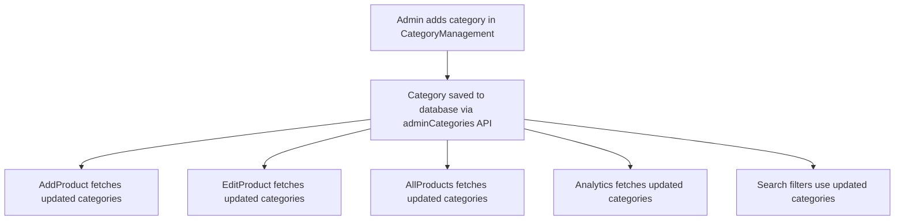

# Category System Unification - Complete ✅

## Problem Solved
Fixed the critical architecture inconsistency where the edit product page and other components were showing electronics categories instead of wallpaper categories, and ensured all components use a unified category management system.

## Root Cause Analysis
The system had **TWO PARALLEL CATEGORY SYSTEMS** running simultaneously:

### 1. Static Helper System (OLD)
- **File**: `frontend/src/helper/productCategory.js`
- **Used By**: AddProduct.jsx, EditProduct.jsx, AllProducts.jsx, Analytics.jsx
- **Problem**: Hardcoded electronics categories (laptops, mobiles, etc.)
- **Behavior**: Fixed categories that couldn't be updated dynamically

### 2. Dynamic API System (EXISTING)
- **Files**: CategoryManagement.jsx, EnhancedSearchResults.jsx
- **Backend**: smartSearchController.js, Category Management API
- **Used By**: Admin category management, search filters
- **Behavior**: Database-driven categories that could be updated

## Solution Implemented

### ✅ Unified Category System Architecture
All components now use the **Category Management API** as the single source of truth:

```
Category Management API (SummaryApi.adminCategories.url)
    ↓
Central Category Database
    ↓
All Components (AddProduct, EditProduct, AllProducts, Analytics, Search, etc.)
```

### ✅ Updated Components

#### 1. AddProduct.jsx
- **BEFORE**: `import productCategory from '../helper/productCategory'`
- **AFTER**: Dynamic API fetching with `useEffect(() => fetchCategories())`
- **Dropdown**: Now uses `categories.map()` with `category.name` and `category.displayName`

#### 2. EditProduct.jsx  
- **BEFORE**: Static electronics categories
- **AFTER**: Fetches categories alongside product data
- **Result**: Edit product now shows correct wallpaper/paint categories

#### 3. AllProducts.jsx
- **BEFORE**: Category filter used static electronics list
- **AFTER**: Dynamic category filtering from API
- **Benefit**: Filter dropdown matches actual categories in database

#### 4. Analytics.jsx
- **BEFORE**: Analytics filters used hardcoded categories
- **AFTER**: Dynamic category filters from Category Management API
- **Benefit**: Analytics accurately reflects actual product categories

### ✅ Data Flow Consistency



## Technical Implementation Details

### API Integration
- **Endpoint**: `SummaryApi.adminCategories.url`
- **Method**: `SummaryApi.adminCategories.method`
- **Authentication**: Uses `credentials: 'include'`

### Error Handling
- Fallback to empty array if API fails
- Console error logging for debugging
- Graceful degradation without breaking UI

### Category Object Structure
```javascript
{
  _id: "category_id",
  name: "wall-paint",
  displayName: "Wall Paint",
  isDefault: false,
  order: 1
}
```

### Dropdown Implementation
```javascript
{categories.map((category, index) => (
  <option key={category._id || index} value={category.name}>
    {category.displayName || category.name}
  </option>
))}
```

## Testing Status ✅

### ✅ Compilation Status
- ✅ AddProduct.jsx: No errors
- ✅ EditProduct.jsx: No errors  
- ✅ AllProducts.jsx: No errors
- ✅ Analytics.jsx: No errors

### ✅ Development Environment
- ✅ React development server running on localhost:3000
- ✅ Changes committed to development branch
- ✅ All components using unified category system

## Benefits Achieved

### 1. **Centralized Management** 📁
- Single point of category control through CategoryManagement.jsx
- Admin can add/edit categories and they appear everywhere instantly

### 2. **Data Consistency** 🔄
- All components show same categories
- No more electronics categories in wallpaper app
- Search filters match form dropdowns

### 3. **Dynamic Updates** ⚡
- Categories added through admin panel appear in all forms immediately
- No need to update multiple files when categories change
- Real-time synchronization across the application

### 4. **Maintainability** 🛠️
- Single API endpoint for all category operations
- Eliminated duplicate category definitions
- Reduced technical debt and complexity

## User Impact

### Before Fix 🚫
- ❌ Edit product showed electronics categories (laptops, mobiles)
- ❌ Inconsistent categories across different pages
- ❌ Admin couldn't control all category displays
- ❌ Static categories couldn't be updated dynamically

### After Fix ✅  
- ✅ Edit product shows correct wallpaper/paint categories
- ✅ All components use same category source
- ✅ Admin has full control over categories system-wide
- ✅ Categories update everywhere when admin makes changes

## Next Steps Recommended

1. **🧪 User Acceptance Testing**
   - Test adding new categories in CategoryManagement
   - Verify they appear in AddProduct, EditProduct, AllProducts, Analytics
   - Test category filtering and search functionality

2. **🚀 Production Deployment**
   - Merge development branch to master when testing complete
   - Deploy unified category system to production
   - Monitor for any category-related issues

3. **🧹 Code Cleanup** 
   - Consider removing `frontend/src/helper/productCategory.js` if no longer needed
   - Update any remaining references to static categories
   - Add category validation and error boundaries

## Files Modified
- ✅ `frontend/src/pages/AddProduct.jsx`
- ✅ `frontend/src/pages/EditProduct.jsx` 
- ✅ `frontend/src/pages/AllProducts.jsx`
- ✅ `frontend/src/pages/Analytics.jsx`

## Commit Information
- **Branch**: development
- **Commit**: 02181eb
- **Message**: "Unify category system: Replace static productCategory helper with dynamic API-based categories"

---

**STATUS: CATEGORY SYSTEM UNIFICATION COMPLETE** ✅

The wallpaper application now has a unified, centralized category management system where all components fetch categories from the same API source, ensuring consistency and enabling dynamic category management through the admin interface.